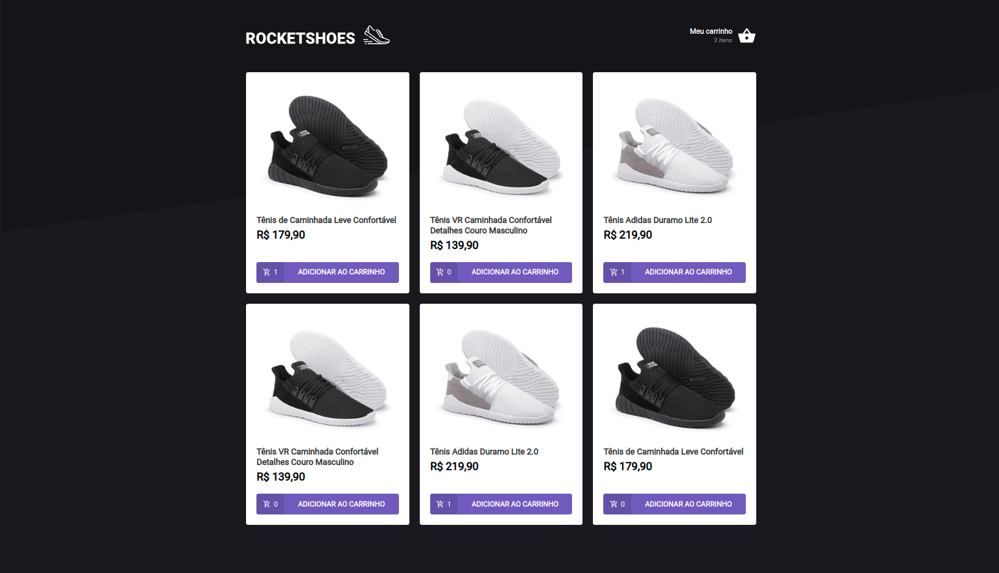
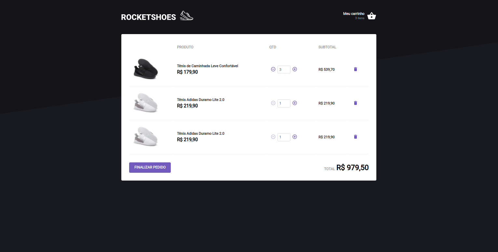

<p align="center">Ignite Challenge</p>
<h1 align="center"> 
	rocketshoes
</h1>

<div aling="center" id="top">

  <p align="center">  
    
        
      
  </p>

  <p align="center">
    <a href="#about">About</a> &#xa0; | &#xa0;
    <a href="#screens">Screens</a> &#xa0; | &#xa0;
    <a href="#technologies">Technologies</a> &#xa0; | &#xa0;
    <a href="#requirements">Requirements</a> &#xa0; | &#xa0;
    <a href="#installation">Installation</a> &#xa0;
  </p>
</div>

## About

rocketshoes is a web application for an online shoe store, where the main objective of the challenge was to create a shopping cart hook, with the following features:

- add a new product to the cart;
- remove a product from the cart;
- change the quantity of a product in the affection;
- calculate the subtotal and total of the cart;
- stock validation;
- display error message.

## Screens




## Technologies

- React.Js
- TypeScript
- Styled Components
- API Requests (JSON Server)
- Axios
- localStorage API

## Requirements

- [Git](https://git-scm.com/)
- [Node.js](https://nodejs.org/en/)
- [Yarn](https://yarnpkg.com/)

## Installation

To make it run on your machine, follow the steps below

```bash
# Clone the repository in some folder on your machine
$ git clone git@github.com:robsonnatanael/rocketshoes.git

# Enter the repository
$ cd rocketshoes

# Install the dependencies by typing in the terminal
$ yarn install

# Run the application
$ yarn start
```

<div align="right">
Connect with me

[](https://www.linkedin.com/in/robsonnatanael)
[](https://twitter.com/robsonnatanael)
[](https://app.rocketseat.com.br/me/robsonnatanael)

</div>
